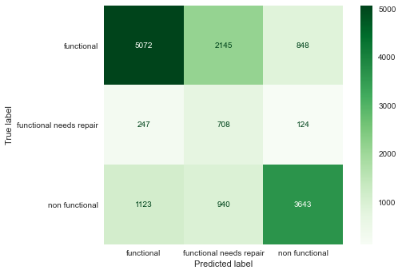
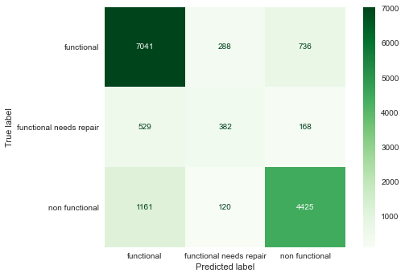
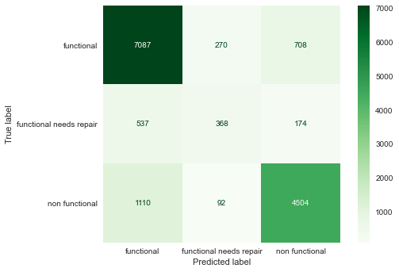
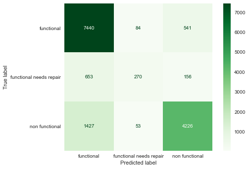
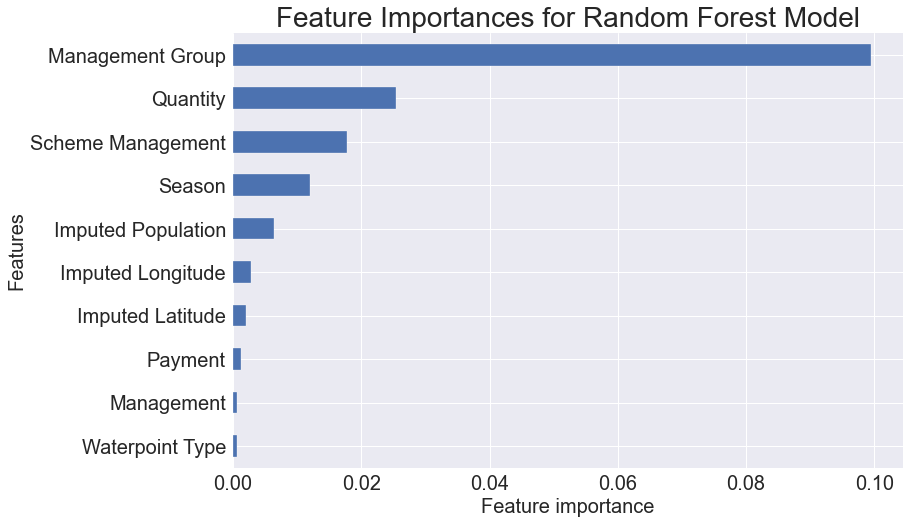
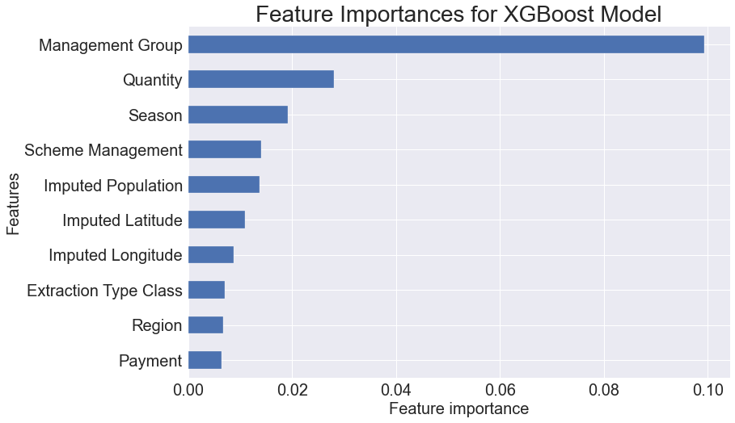
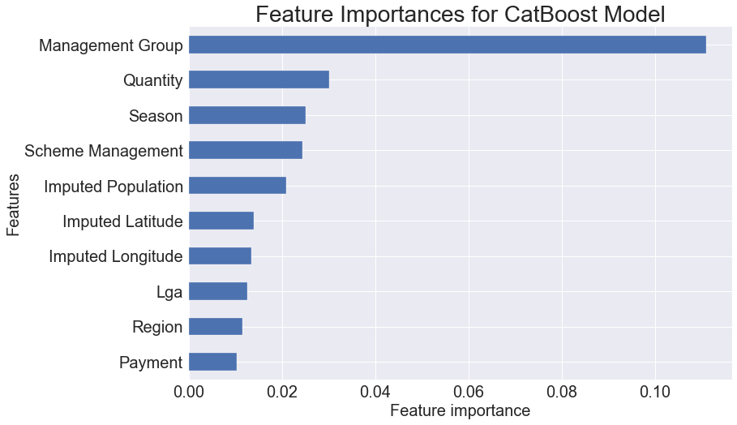
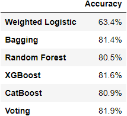
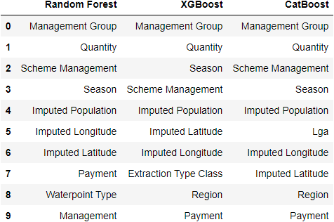

# Tanzania Water Well Classification Model

## Problem

Tanzania like many developing nations has inadequate water infrastructure. Many people throughout the country depend on local pumps constructed and funded by the government, NGOs, and various private individuals. Charitable and NGO resources seeking to help improve and maintain what infrastructure there is would be aided by knowledge of a number of things.

* Where are there pumps that are broken or in need of repair to prevent failure?
* What features of the pumps, areas, installers, etc. tend to be correlated with pump failure?

To figure out what pumps need to be fixed or maintained you could obviously send people into the field to manually inspect all the pumps, but this gets quite expensive. Having a decent classification model can allow the government or NGOs to make predictions about what pumps are most likely to have problems without having to directly inspect them and thus more efficiently allocate resources for replacements or repairs.

## The Data

The raw training data consisted of 59400 pumps with 39 recorded features beyond the id number. A full account of the cleaning process can be found in the [Cleaning and Feature Engineering notebook](./Cleaning_and_Feature_Engineering.ipynb)

### Outline of Cleaning
The mode was imputed for the missing boolean data, for example, on whether pumps were permitted or there we public meetings

Missing lat-long and GPS height info was imputed from the mean of the smallest region that it was still known that the pump was in.

Some data entry issues, such as differences in capitalization and abbrevations in the funder and installer data was fixed and funders and installers with less than 20 pumps were grouped as "other".

Pump age and season features were engineered from the date that the pump data was recorded and the construction year of the pump.

Clearly duplicate columns or those with unacceptable overlap were droped.

## The Models

To solve this classification problem, we first constructed a series of baseline models of different types. We then tuned their hyperparameters using a gridsearch and then formed a voting model from the four best performing models. A full account of the modeling process can be found in the [Modeling notebook](./Modeling.ipynb)

### Base Logistic Model
The first model constructed was a weighed (giving extra weight to 'needs repair data') logistic model which had an accuracy of 63.4%



### Base Bagging Model
The first ensemble model used was a bagging model which had an accuracy of 79.8%. 



### BaseRandom Forest Model
The base random forest model had an accuracy of 80.5%



### Base XGBoost Model
The base XGBoost model had an accuracy of 80.3%



### Base CatBoost Model
The base CatBoost model had an accuracy of 80.5%


### Oversampled Models
An oversampled version of each model was run and each was less accurate overall with only minimal gain in performance on the needs repair category. There is likely a lot of ranom noise in how pumps are classed into that category.

### Final Voting Model
A gridsearch was performed to find better hyperparameters for the bagging, forest, XGBoost and Catboost models, these were then placed into a voting model.

The final voting model had an accuracy of 81.9%


## Feature Importance
Mean permutation importance was used to calculate the most important features for the Random Forest, XGBoost, and Catboost models.







## Overall Results
Here is a chart breaking down the performance of the models



The consistently most important features across the models were managment group and scheme as well as the quantity of water at the pump, the season the pump was tested and the size of the population using the pump.



## Conclusions and Recommendations
Based on this analysis I would suggest that the government or any NGOs seeking to install pumps in Tanzania be very careful in the selection of who will manage the pump. It is also vitally important to engage in good water managment practices since depleteing the reserves of water in the pump areas obviously significantly impacts whether the pump will function in getting people water.

It would also make sense to do a more systematic analysis of seasonal effects by observing the same pump in different seasons, which could help determin which pumps are function for part of the year and thus the population may need supplimental water from another source during dry seasons.

## Limitations and Future Work

The data given by the competition only covers a narrow range of time, if more data is captured in the future on the same pumps or a RCT was done, a more accurate analysis of what features affect the functioning of pumps could be done, as well as a more causal rather than correlative analysis of the effect of different variables.

## For More Information

Please review my full analysis in our [Jupyter Notebook](./technical_notebook.ipynb) or our [presentation](./Pump_Presentation.pdf)

For any additional questions, please contact **Lia Elwonger lelwonger@gmail.com**

## Repository Structure

```
├── README.md                               <- The top-level README for reviewers of this project
├── technical_notebook.ipynb                <- Full account of the clean of the data and the modeling process in Jupyter notebook
├── cleaning_and_feature_engineering.ipynb  <- Account of just the process of cleaning the data in Jupyter notebook
├── modeling.ipynb                          <- Account of just the modeling process in Jupyter notebook
├── data                                    <- Contains data from the Pump It Up competition, a pickle of the cleaned data, and a csv of the predictions
├── code                                    <- Custom functions for cleaning and processing the data and constructing visualizations
└── images                                  <- Saved charts for display in README.md
```
